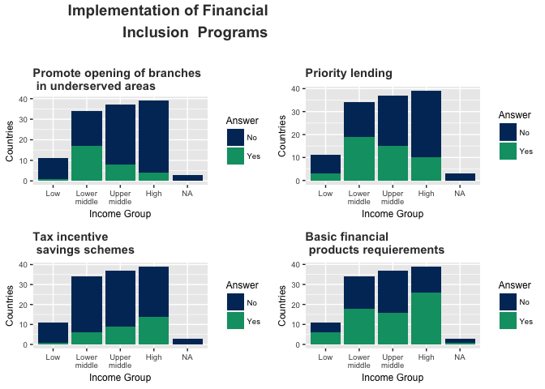

Assignment 1 Part 2
================
Lucia Delgado
6 de abril de 2018

**Source:** World - Global Financial Inclusion and Consumer Protection Survey 2017. Retireved on april 2018 from <http://microdata.worldbank.org/index.php/catalog/2946/data_dictionary>

**Note:** The graph displays answers of countries in different income groups to the question: "Which of the following programs or policies has your country implemented to promote financial inclusion?"

Part 2: ggplot2 and the grammar of graphics
-------------------------------------------

### About the graph

The information showed in the graph was obtained from the Global Financial Inclusion and Consumer Protection Survey 2017, published by the World Bank. This survey was administered to financial authorities in each country.

The figure shows the number of countries by income group that reported to have implemented specific policies to promote financial inclusion. This information shades lights on how common each of these policies are around the globe. This can be useful when comparing the strategy to promote financial inclusion for a specific country with policies implemented in other countries. The income dimension is important, since it is likely that countries with similar income levels have similar priorities in terms of financial inclusion.

The figure focuses on four policies: (1) promoting opening of branches in underserved areas, (2) priority lending, (3) tax incentives saving schemes, and (4) requirements for basic financial inclusion.

From the graph we can tell that programs to promote the opening of branches in underserved areas and priority lending programs are more common in lower middle income countries. On the other side, tax incentives for saving schemes are more common in high income countries. Requirements for basic financial products are a common policy in countries from all income groups. In addition, requirements for basic financial products is the only policy that has been implemented by more than half of the countries in the low income group.

The goal of the figure is to provide information on how many countries have implemented each policy. A bar plot is useful in this case, because it allows to observe how many countries in each group have implemented the policy. Since there are only two possible answers to each question, using a color encoding makes it easy to display the information on the proportion of countries that have implemented the policy. Moreover, it allows to observe proportions while also providing information on absolute values.

A bar plot for each policy is constructed to make comparisons within each policy easy. A single bar graph containing information for all the policies can make it difficult to the reader to interpret the graph, and might lead to incorrect conclusions. In addition, four separate bar plots allow to observe in detail the information of each graph. A larger number of separate plots will not allow enough space to display the axis of each plot.

The colors were selected from a colorblind-friendly palette. In addition, the font size for all the text elements is large enough to be easily read. No data transformation where made to the data, since the goal is to provide information of the number of countries in each category.
